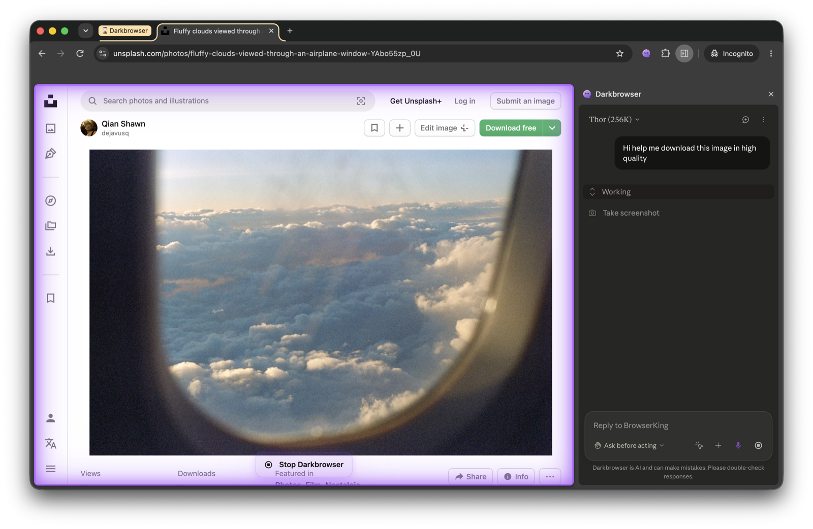
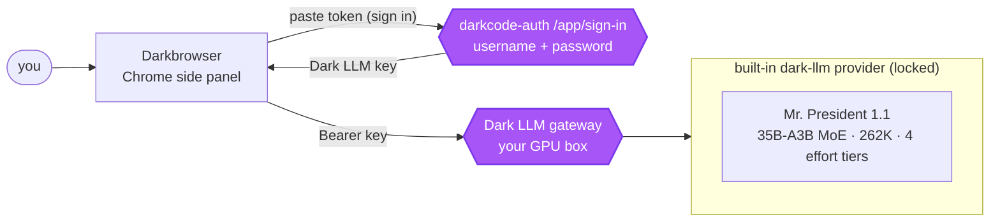

<h1 align="center">Darkbrowser</h1>

<p align="center">
  <b>A browser agent wired to your own private, uncensored LLM - not someone else's cloud.</b>
</p>

<p align="center">
  Chrome side-panel agent &nbsp;·&nbsp; one hard-locked gateway &nbsp;·&nbsp; hard sign-in, no guest access
</p>

<p align="center">
  <a href="#install"></a>
  <a href="LICENSE"></a>
  <a href="#relationship-to-claude-for-chrome"></a>
  <a href="#the-lock"></a>
  <a href="#status"></a>
</p>

<p align="center">
  <a href="#the-unlock">The unlock</a> ·
  <a href="#install">Install</a> ·
  <a href="#sign-in">Sign in</a> ·
  <a href="#models">Models</a> ·
  <a href="#commands">Commands</a> ·
  <a href="#the-lock">The lock</a> ·
  <a href="#architecture">Architecture</a>
</p>

---

<p align="center">
  
</p>

### ⚡ Install (Chrome / Chromium 116+)

```bash
git clone https://github.com/dark-crop/darkbrowser-chrome.git
```

Then open `chrome://extensions` &rarr; enable **Developer mode** &rarr; **Load unpacked** &rarr; select the
`darkbrowser-chrome` folder. No build step. Open the side panel (`Cmd/Ctrl + E`) and sign in with your
Dark LLM account. [Full install &amp; sign-in &rarr;](#install)

## The unlock

Most browser agents route everything you see and do on the web through a vendor's cloud.
**Darkbrowser routes it to a machine you own.** It is a hard-locked Chrome side-panel agent for the
self-hosted [**Dark LLM**](https://github.com/dark-crop/dark-core) gateway - your own uncensored
models, on your own GPU box. It talks to **one gateway and nothing else**: no OpenAI, no Anthropic, no
telemetry to a third party.

It keeps the full browser-automation toolkit (screenshots, clicks, typing, scrolling, multi-tab
navigation, workflow recording) and layers on the two changes that make it yours: the **provider
lock** to Dark LLM, and a **hard sign-in** - the agent will not run for anyone who has not signed in
with a Dark LLM account. Same lock, same credential, same "no guest access" as the
[**darkcode**](https://github.com/dark-crop/darkcode-cli) CLI.



## Highlights

| | |
|---|---|
| 🔒 **One gateway, one provider** | Hard-locked to `dark-llm`. The other 15 providers exist in code but never surface in the UI. |
| 🚪 **Hard sign-in, no guest** | The agent refuses every request until you sign in with a Dark LLM account and store a real token. |
| 🧠 **One model, four efforts** | **Mr. President 1.1** (35B-A3B MoE, 262K); `/effort` picks the reasoning tier (low → ultra). The model name comes **live from the gateway**, never hardcoded. |
| ⚡ **Effort control** | `/effort low\|med\|high\|ultra` sets the reasoning tier (default high). Just like the darkcode CLI. |
| 🖱 **Full browser toolkit** | Screenshots, clicks, typing, scrolling, tab navigation, and workflow recording, all intact. |
| 👁 **Reads screenshots** | Mr. President loads an mmproj projector on the gateway, so the agent's screenshots reach the model. |
| 🎨 **Power-purple UI** | The whole panel themes to Dark LLM purple - sidebar, send button, page-glow border, blob icon. |

## Install

Darkbrowser isn't on the Chrome Web Store (unsigned) - install it unpacked:

1. Clone this repo:
   ```bash
   git clone https://github.com/dark-crop/darkbrowser-chrome.git
   ```
2. Open `chrome://extensions` in Chrome (or any Chromium 116+ browser).
3. Enable **Developer mode** (top-right toggle).
4. Click **Load unpacked** and select the `darkbrowser-chrome` folder.
5. Pin the **Darkbrowser** icon and open the side panel with the icon or `Cmd/Ctrl + E`.

There is no build step - the extension loads directly from source.

## Sign in

Darkbrowser will not run until you sign in. This mirrors the darkcode CLI's browser flow: sign in on
the gateway page, then paste the token back.

1. On the side panel's **Sign in** takeover (or Options -> Providers -> Dark LLM account), click
   **Open sign-in page**. It opens `https://dark-llm.cropbinary.com/app/sign-in`.
2. Sign in there with your Dark LLM **username and password**. The page shows your access token.
3. Copy the token, paste it into the **access token** field, and click **Sign in**.

The token is validated against the gateway (`/v1/models`) before it is stored, and your username is
read back from `/key/info` so the account shows who you are. `/logout` (or the Sign out button)
clears it and re-locks the agent.

> **Don't have an account?** Accounts are provisioned on the box with
> [`add-user.py`](https://github.com/dark-crop/dark-core/blob/main/docs/users.md). Each account gets
> its own usage tier and private RAG store.

## Model

One lane routes to your gateway: **Mr. President 1.1** (Qwen3.6 35B-A3B MoE, 262K context, reads
screenshots). The model name is loaded **live from the gateway**, never hardcoded.

**Effort control (like the darkcode CLI):** `/effort low|med|high|ultra` sets the reasoning tier
(default **high**). Darkbrowser maps it to the real gateway
model id (`president` + effort `high` -> `president-high`). Mr. President loads a multimodal projector
on the gateway, so it reads the agent's screenshots directly.

## Commands

Type `/` in the chat to see them.

| Command | Effect |
|---|---|
| `/effort` | Open the effort picker (Low / Med / High / Ultra, active tier highlighted). `/effort high` sets it directly. |
| `/logout` | Sign out (clears your token); the sign-in screen reappears. Alias: `/signout`. |
| `/compact` | Clear history, keep a summary (built in). |

## The lock

The lock is deliberately small and lives in a few well-contained places:

| Where | What it does |
|---|---|
| `provider-registry.js` | `LOCKED_PROVIDER = 'darkllm'`. Only Dark LLM is enabled and active; every fallback resolves to it. |
| `api-adapter.js` | The sign-in gate: `isSignedIn()` rejects every request with a placeholder / empty key. No guest access. |
| `provider-settings.*` / `signin-banner.js` | Surface only the Dark LLM account card + side-panel sign-in takeover. |
| `auth-bypass.js` | Silences the *upstream* Claude login only - it never mints a usable Dark LLM key. |

The other 15 provider definitions from the upstream project are kept in code (so the routing path is
unchanged) but are hidden in the UI and never active.

## Architecture

Darkbrowser is based on Anthropic's **Claude for Chrome** extension. It does not reimplement browser
automation - it **intercepts** the stock extension's calls to `api.anthropic.com/v1/messages` and
re-routes them to your gateway, translating Anthropic <-> OpenAI on the fly.

| File | Purpose |
|---|---|
| `provider-registry.js` | Provider definitions, the Dark LLM lock, the 3 lanes, state management |
| `api-adapter.js` | API translation (Anthropic <-> OpenAI), the sign-in gate, `/effort` + `/logout`, effort -> model |
| `provider-settings.*` / `signin-banner.js` | Options sign-in card + side-panel sign-in takeover (paste flow) |
| `effort-dialog.js` | The `/effort` picker modal |
| `ui-branding.js` / `brand-overlay.js` | Re-skin the panel + page glow to Dark LLM purple |
| `auth-bypass.js` | Keeps the stock extension from showing Claude's own login (placeholder tokens only) |

Requests flow: **stock extension -> `fetch` intercept in `api-adapter.js` -> sign-in gate -> translate
to `chat/completions` -> `https://dark-llm.cropbinary.com/v1` with your Bearer token.**

## Security

- **No guest access.** With no valid token, `api-adapter.js` returns a 401-style error to the agent and
  nothing reaches the gateway.
- **Token stays local.** Your Dark LLM key lives in `chrome.storage.local` on your machine and is only
  ever sent to the gateway as a Bearer header.
- **Sign-in is the same service as the CLI.** The `/app/sign-in` page is served by
  [`darkcode-auth`](https://github.com/dark-crop/dark-core), which validates your username/password
  (PBKDF2-hashed store) and hands back your LiteLLM virtual key - carrying all your per-user usage
  limits and private vector store.

## Relationship to Claude for Chrome

Darkbrowser is a fork of Anthropic's
[Claude for Chrome](https://chrome.google.com/webstore/detail/claude/danfohhfmbeahkgpceibgibfpkhokbfp)
extension (via the open-source multi-provider BrowserKing project). The browser-automation engine is
upstream's; Darkbrowser adds the provider lock, the hard sign-in gate, and the Dark LLM branding. MIT
licensed.

## Family

Part of the [**dark-crop**](https://github.com/dark-crop) family:

- [**darkcode-cli**](https://github.com/dark-crop/darkcode-cli) - terminal coding agent, same lock.
- [**dark-core**](https://github.com/dark-crop/dark-core) - the gateway: LiteLLM, darkcode-auth,
  image bridge, pgvector RAG.
- **Darkbrowser** - this repo, the browser agent.

## Status

Early preview. The lock, hard sign-in (options card + side-panel takeover), two-axis model with
`/effort`, and vision (all lanes read screenshots) all work. License: MIT.
